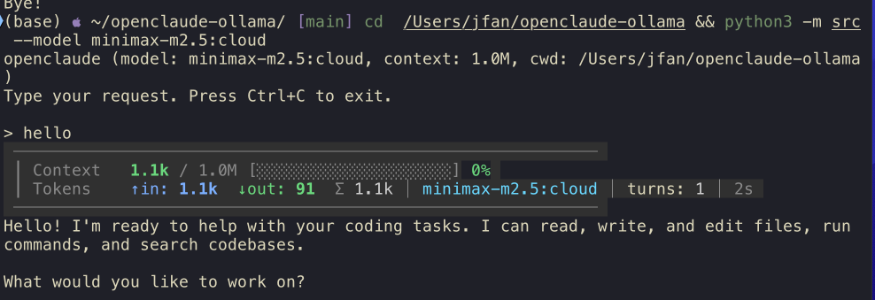

# OpenClaude

**用开源模型构建你自己的智能编程助手。**

本项目从 [Claude Code](https://docs.anthropic.com/en/docs/claude-code)（Anthropic 的 AI 编程智能体）中提取核心架构设计，用 ~500 行 Python 重新实现，可搭配**任何支持 tool use 的模型**运行 —— Ollama、vLLM、OpenAI、DeepSeek、Together AI 等。

> **这不是 Claude Code 的 fork。** 这是一个通过研究 Claude Code [反编译源码](https://github.com/anthropics/claude-code)（v2.1.88）后的全新实现。目标是教学：理解*为什么*智能体系统比单次模型调用效果更好，并构建属于你自己的。

**语言**: [English](README.md) | **中文**



---

## 为什么智能体比单次调用更强

单次调用 LLM 就像蒙着眼写代码。智能体循环让模型可以 **观察 → 行动 → 观察 → 修正**：

```
你: "修复 src/auth.py 中失败的测试"

智能体:
  → Bash(pytest tests/test_auth.py)            # 观察：什么测试失败了？
    ← FAILED test_login - AttributeError: 'User' has no attribute 'is_active'
  → Read(src/auth.py)                           # 观察：代码长什么样？
    ← 1: class User: ...
  → Grep("is_active", path="src/")              # 观察：is_active 在哪里被使用？
    ← src/models.py:42: is_active = Column(Boolean)
  → Read(src/models.py, offset=38, limit=10)    # 观察：看看模型定义
    ← 42: active = Column(Boolean)              # 找到了 —— 字段被重命名为 'active'
  → Edit(src/auth.py, old="user.is_active", new="user.active")  # 行动：修复
    ← Edited src/auth.py
  → Bash(pytest tests/test_auth.py)             # 验证：现在通过了吗？
    ← PASSED

"已修复：models.py 中 `is_active` 被重命名为 `active`，已同步更新 auth.py。"
```

这个循环 —— 用任何足够强的模型都能驱动 —— 就是 Claude Code、Cursor、Aider 以及所有现代编程智能体的核心思想。

## 快速开始

### 1. 安装

```bash
git clone https://github.com/JFan5/openclaude-ollama.git
cd openclaude-ollama
pip install -r requirements.txt
```

### 2. 启动模型

**方式 A：Ollama（本地，免费）**
```bash
ollama pull qwen2.5:32b   # 或 qwen2.5:72b 获得最佳效果
# Ollama 会自动在 localhost:11434 提供服务
```

**方式 B：云端 API（不需要 GPU）**
```bash
# Together AI
export OPENAI_BASE_URL=https://api.together.xyz/v1
export OPENAI_API_KEY=你的密钥
export MODEL=Qwen/Qwen2.5-72B-Instruct-Turbo

# DeepSeek
export OPENAI_BASE_URL=https://api.deepseek.com/v1
export OPENAI_API_KEY=你的密钥
export MODEL=deepseek-chat
```

所有支持的模型和服务商见 [docs/model-comparison.md](docs/model-comparison.md)。

### 3. 运行

```bash
# 交互式 REPL
python -m src

# 单次执行
python -m src "找出这个项目中所有的 TODO 注释并列出来"

# 指定模型
python -m src --model minimax-m2.5:cloud "重构数据库模块，使用连接池"
```

## 项目结构

```
src/
├── agent.py      # 智能体循环（核心模式，源自 Claude Code 的 query.ts）
├── tools.py      # 工具定义（源自 Tool.ts 的设计模式）
├── context.py    # 动态系统提示词组装（源自 context.ts）
├── compact.py    # 上下文窗口管理（源自 services/compact/）
└── __main__.py   # CLI 入口

docs/
├── architecture.md      # 深度解析：Claude Code 的 7 大设计模式
└── model-comparison.md  # 哪些开源模型最适合做智能体

examples/
└── AGENT.md             # 项目记忆文件示例（类似 CLAUDE.md）
```

**总计约 500 行 Python。** Claude Code 是约 30,000 行 TypeScript —— 但其中大部分是 UI、流式传输、分析埋点和 Anthropic API 适配。核心智能体逻辑是模型无关的。

## 从 Claude Code 提炼的 7 个关键设计模式

这些架构洞察是区分玩具 demo 和生产级智能体的关键。每一个都在本项目中有实现：

### 1. 动态系统提示词 (`src/context.py`)

不要用静态 prompt。注入实时上下文：
- 当前工作目录、操作系统、Shell
- Git 分支、状态、最近提交
- 来自 `AGENT.md` 的项目特定指令

### 2. 标准化工具接口 (`src/tools.py`)

每个工具都有：名称、描述（给模型看的）、JSON Schema（参数校验）、执行函数和只读标志（用于并发控制）。工具返回错误字符串而不是抛出异常。

### 3. 错误恢复（`src/agent.py` 中的循环）

当工具失败时，错误信息作为 `tool_result` 返回给模型。模型看到错误后会尝试不同的方法。这是智能体优于单次调用的**头号原因**。

### 4. 上下文窗口管理 (`src/compact.py`)

当对话过长时，旧消息由模型进行摘要。最近的消息原封不动保留。这可以防止长会话中上下文窗口溢出。

### 5. 输出预算 (`src/tools.py:MAX_OUTPUT_CHARS`)

工具输出被截断到预算范围内。对一个 10MB 文件执行 `cat` 不会撑爆上下文 —— 工具返回截断结果并附带提示。

### 6. 项目记忆 (`AGENT.md`)

在项目根目录放一个 `AGENT.md`（或 `CLAUDE.md`）文件。它会自动加载到系统提示词中，让智能体拥有跨会话的项目专属知识。

### 7. 并发感知 (`src/tools.py:read_only`)

工具声明自身是否只读。只读工具（Grep、Glob、Read）可以安全地并行执行。写入工具（Edit、Write、Bash）必须串行执行。（并行执行尚未在本项目中实现 —— 这是一个简单的扩展。）

> 完整深度解析见 [docs/architecture.md](docs/architecture.md)。

## 命令行参数

```
用法: openclaude [-h] [--model MODEL] [--base-url URL] [--api-key KEY]
                  [--context-window N] [--max-turns N] [--quiet]
                  [prompt]

参数:
  prompt                单次执行的提示词（省略则进入交互式 REPL）
  --model, -m           模型名称（默认: $MODEL 或 qwen2.5:latest）
  --base-url            API 地址（默认: $OPENAI_BASE_URL 或 localhost:11434）
  --api-key             API 密钥（默认: $OPENAI_API_KEY 或 "ollama"）
  --context-window, -c  上下文窗口大小（token 数，默认: 32000）
  --max-turns, -t       最大智能体循环次数（默认: 30）
  --quiet, -q           静默模式，不显示工具调用日志
```

## 扩展：添加你自己的工具

添加工具很简单 —— 定义一个 `ToolDef` 并加入 `ALL_TOOLS`：

```python
# 在 src/tools.py 中

def _my_tool(args: dict) -> str:
    """始终返回字符串。包括错误 —— 永远不要抛出异常。"""
    try:
        result = do_something(args["input"])
        return str(result)
    except Exception as e:
        return f"Error: {e}"   # 模型会看到这个错误并自适应

MyTool = ToolDef(
    name="MyTool",
    description="这个工具做什么（模型会阅读这段描述！）",
    parameters={
        "type": "object",
        "properties": {
            "input": {"type": "string", "description": "模型应该传入的内容"},
        },
        "required": ["input"],
    },
    execute=_my_tool,
    read_only=True,   # 如果不修改状态则为 True
)

ALL_TOOLS.append(MyTool)
```

## 功能状态

### 已实现

| 功能 | Claude Code 源码 | 本项目实现 | 说明 |
|------|-----------------|-----------|------|
| 智能体循环 | `query.ts` | `src/agent.py` | 多轮 观察→行动→修正 循环 |
| Bash 工具 | `tools/BashTool/` | `src/tools.py` | 执行 shell 命令，带超时和安全检查 |
| 文件读取 | `tools/FileReadTool/` | `src/tools.py` | 带行号的文件读取，支持偏移和限制 |
| 文件编辑 | `tools/FileEditTool/` | `src/tools.py` | 精确字符串替换，输出 diff |
| 文件写入 | `tools/FileWriteTool/` | `src/tools.py` | 创建或覆盖文件 |
| Grep 搜索 | `tools/GrepTool/` | `src/tools.py` | 跨文件正则搜索 |
| Glob 搜索 | `tools/GlobTool/` | `src/tools.py` | 按 glob 模式查找文件 |
| 动态系统提示词 | `context.ts` | `src/context.py` | 运行时注入操作系统、cwd、git 状态、项目记忆 |
| 项目记忆 | `utils/claudemd.ts` | `src/context.py` | 加载 `AGENT.md` / `CLAUDE.md` 到系统提示词 |
| 自动压缩 | `services/compact/` | `src/compact.py` | 上下文窗口接近上限时自动摘要旧消息 |
| 输出预算 | `Tool.ts:maxResultSizeChars` | `src/tools.py` | 截断过大的工具输出，防止上下文溢出 |
| 错误恢复 | `toolExecution.ts` | `src/agent.py` | 错误作为字符串返回，让模型自我修正 |
| 工具只读标志 | `Tool.ts:isConcurrencySafe` | `src/tools.py` | 工具声明是否为只读 |
| 最大轮次保护 | `QueryEngine.ts:maxTurns` | `src/agent.py` | 防止无限循环（默认 30 轮） |
| 单次执行模式 | `entrypoints/cli.tsx` | `src/__main__.py` | 从命令行运行单个提示词 |
| 交互式 REPL | `replLauncher.tsx` | `src/__main__.py` | 带 readline 支持的交互式提示符 |
| 多服务商支持 | `services/api/client.ts` | `src/__main__.py` | Ollama、vLLM、OpenAI、DeepSeek、Together AI 等 |
| 危险命令过滤 | `bashPermissions.ts` | `src/tools.py` | 阻止明显有破坏性的 shell 命令 |
| API 重试 | `services/api/withRetry.ts` | `src/agent.py` | API 失败时自动重试一次 |

### 待实现

| 功能 | Claude Code 源码 | 优先级 | 说明 |
|------|-----------------|--------|------|
| 流式响应 | `services/api/claude.ts` | 高 | 逐 token 显示模型输出 |
| 并发工具执行 | `toolOrchestration.ts` | 高 | 并行运行只读工具 |
| 权限系统 | `useCanUseTool.tsx` | 高 | 执行危险操作前询问用户 |
| 会话持久化 | `utils/sessionStorage.ts` | 中 | 跨会话保存/恢复对话 |
| 子代理 | `tools/AgentTool/` | 中 | 生成子智能体进行子任务分解 |
| Notebook 支持 | `tools/NotebookEditTool/` | 中 | 编辑 Jupyter notebooks |
| 网页抓取 | `tools/WebFetchTool/` | 中 | 获取 URL 并提取内容 |
| 网络搜索 | `tools/WebSearchTool/` | 中 | 搜索网络获取信息 |
| LSP 集成 | `services/lsp/` | 中 | Language Server Protocol 代码智能 |
| 任务系统 | `Task.ts`, `tasks/` | 中 | 带状态跟踪的后台任务 |
| TUI 界面 | `ink/`, `components/` | 低 | 基于 Rich/Textual 的终端 UI |
| MCP 支持 | `services/mcp/` | 低 | 通过 Model Context Protocol 连接外部工具服务器 |
| Hook 系统 | `hooks/`, `utils/hooks.ts` | 低 | 工具执行前后的中间件 |
| Vim 模式 | `vim/` | 低 | Vim 键位绑定 |
| 语音输入 | `voice/` | 低 | 按键说话语音模式 |
| 自动记忆提取 | `services/extractMemories/` | 低 | 自动将学习内容保存到项目记忆 |
| 协调者模式 | `coordinator/` | 低 | 协调者 + 工作者的多智能体编排 |
| 技能系统 | `skills/` | 低 | 可复用的提示词模板（斜杠命令） |
| 成本追踪 | `cost-tracker.ts` | 低 | 跟踪 token 用量和 API 费用 |
| Git 归属 | `utils/commitAttribution.ts` | 低 | 为 git 提交添加 AI 联合作者 |

欢迎为以上任何功能提交 PR。

## 与 Claude Code 的对比

| 维度 | Claude Code | 本项目 |
|------|-------------|--------|
| 语言 | TypeScript + React (Ink) | Python |
| 代码量 | ~30,000 行 | ~500 行 |
| 模型 | 仅 Claude | 任何支持 tool use 的模型 |
| API 耦合度 | 深度绑定（Anthropic SDK 类型遍布全局） | 最小化（OpenAI 兼容接口） |
| UI | 基于 Ink 的完整 TUI | 简单终端 REPL |
| 工具数量 | 40+ | 6（核心必需） |
| 功能 | 流式、子代理、权限、MCP、语音、Vim 模式… | 核心智能体循环 + 工具 |

**核心智能体循环在结构上是一致的。** 其余的都是围绕它的工程化。

## 致谢

- 架构设计源于对 Anthropic [Claude Code](https://docs.anthropic.com/en/docs/claude-code) 的源码研究
- 受开源智能体社区启发：[Aider](https://github.com/paul-gauthier/aider)、[Continue](https://github.com/continuedev/continue)、[SWE-agent](https://github.com/princeton-nlp/SWE-agent)

## 许可证

MIT
